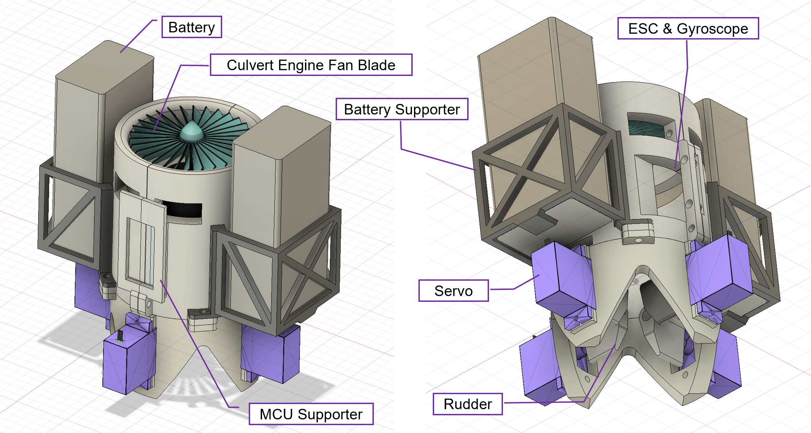
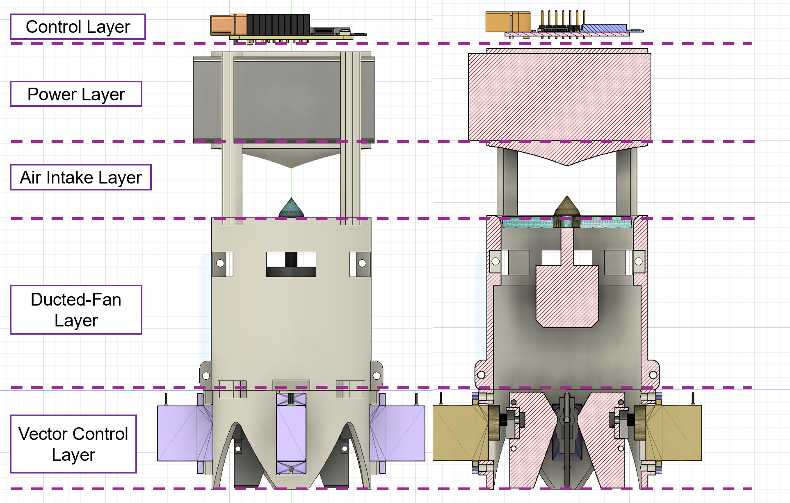
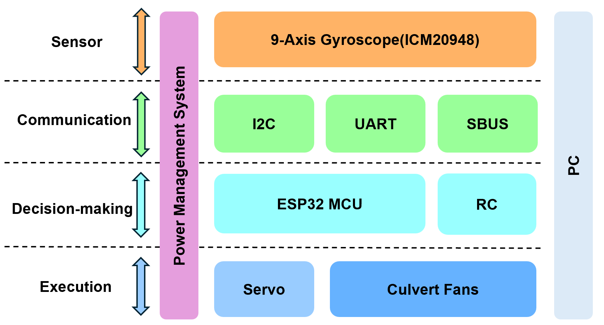
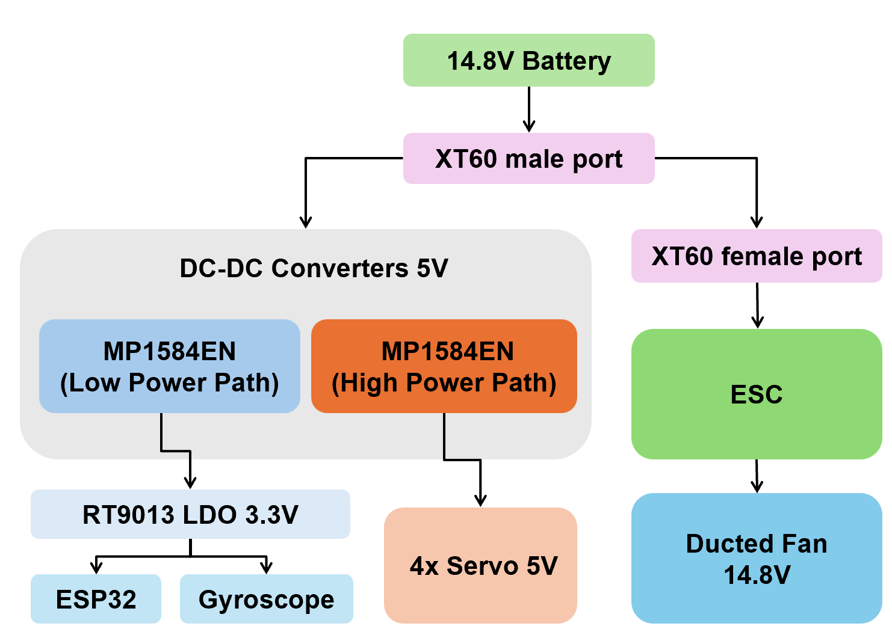
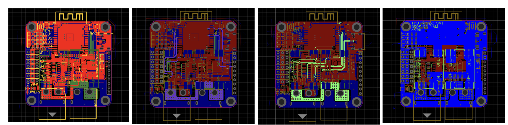
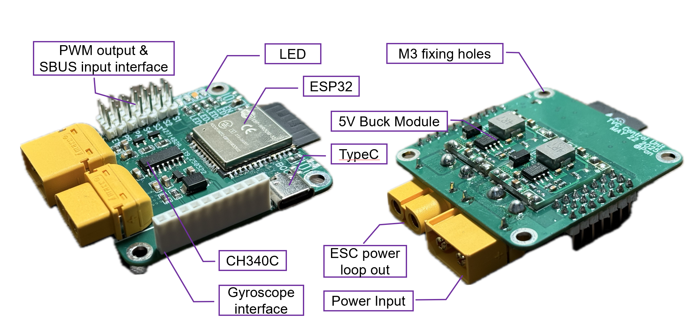
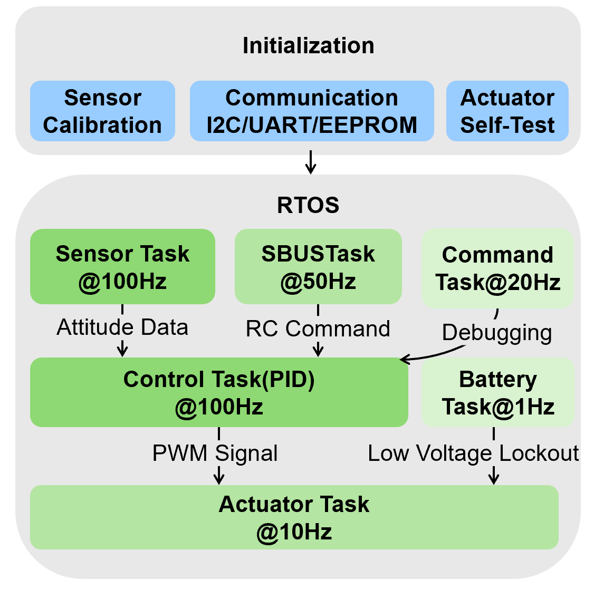
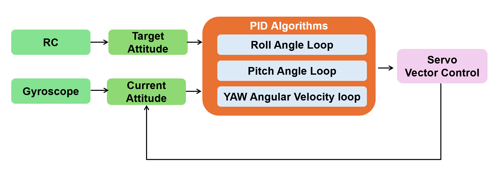

<p align="right">
  <a href="README-en.md">English</a> | <a href="README.md">中文</a>
</p>


# Thrust Vector Control (TVC) for a Single Ducted Fan UAV

<p align="center">
  
</p>

This is a project about implementing Thrust Vector Control (TVC) for a single ducted fan Unmanned Aerial Vehicle (UAV) using gyroscopic sensor feedback.

---

## 🚀 Project Introduction

### What is Thrust Vector Control (TVC)?

Let's start with a little game. Imagine you're trying to balance an inverted water bottle on the palm of your hand, keeping it upright.

<br>
<p align="center">
  
</p>
<br>

When the bottle starts to tilt left, your hand instinctively moves left to create a reaction force, pushing the bottle back to the center. When it tilts right, your hand moves right to correct it, thus achieving balance.

<br>
<p align="center">
  
</p>
<br>

The **Thrust Vector Control** principle in this UAV project is very similar. The four servo vanes at the bottom are like your hand, and the UAV's body is like the bottle. When the UAV's gyroscope sensor (equivalent to our eyes and sense of balance) detects a tilt, the controller immediately commands the corresponding vanes to deflect, changing the direction of the high-speed airflow. This airflow then generates a reaction force that "pushes" the airframe back to a stable state.

By precisely and rapidly controlling this reaction force, the UAV can achieve stable flight in all attitudes—hover, roll, pitch, and yaw—without needing multiple propellers.

### Project Significance

Compared to traditional multi-rotor UAVs that rely on differential motor speeds for attitude control, a single ducted fan TVC UAV offers several significant advantages:

* **Enhanced Maneuverability:** The control torque generated by deflecting servo vanes significantly improves attitude adjustment capabilities during hover and low-speed flight.
* **Decoupled Control:** It avoids the coupling issue of traditional multi-rotors that need to "tilt the body to yaw," allowing for more precise translational and turning maneuvers.
* **Improved Safety and Efficiency:** The ducted design encloses the high-speed rotating blades, enhancing safety while optimizing aerodynamic efficiency.
* **Structural Simplicity:** Only one ducted fan and four servos are needed for full attitude control, greatly simplifying the mechanical structure and electronic drive system, which reduces weight and volume.

---

### Project Challenges

* **High-Frequency Attitude Estimation and Real-Time Closed-Loop Control**
* **Using TVC to Counteract the Single Engine's Rotational Torque**
* **Non-linearity in TVC Servo Control and Aerodynamic Response**
* **Lightweight Hardware Design | High/Low Power Isolation | FreeRTOS Multitasking**

---

## 🛠️ Hardware Design

The hardware system is fundamental to achieving stable flight. This project went through several iterations, from a distributed modular setup to a highly integrated design, ultimately resulting in a compact and reliable hardware platform.

### 1. Mechanical Structure

The mechanical structure was developed over three main versions, all 3D printed with PLA material to balance lightweight design and structural rigidity.

* **V1: Initial Prototype**
    <br>
    <p align="center">
      
    </p>
    
    * Used a split-part structure, mainly to verify component assembly dimensions and interference issues.
    * **Problem:** The enclosed bottom structure blocked airflow in the diagonal directions, causing vector control to fail.

* **V2: Airflow Optimization & Dual-Battery Scheme**
    <br>
    <p align="center">
        
    </p>

    * Large openings were added to the bottom diagonal areas, solving the airflow blockage and increasing servo travel range.
    * Adopted a symmetrical dual-battery layout to balance the center of gravity and designed a heat dissipation duct for the ESC.
    * **Problem:** The dual-battery scheme resulted in excessive total weight, nearing the thrust limit and reducing flight endurance.

* **V3: Final Version - Vertical Stack Integrated Design**
    <br>
    <p align="center">
        
    </p>
    
    * Employed a five-layer vertical stack structure to centralize the center of gravity along the main axis, reducing roll/pitch moments of inertia.
    * Switched to a single-battery solution, significantly reducing the overall weight.
    * **Advantages:** High integration, simplified wiring, reduced electromagnetic interference, and improved control response speed.

### 2. Electronic System

The core of the electronic system is a custom PCB that integrates the main controller, power management, sensor interfaces, and drivers.
The schematic for the main control board is as follows:
<br>
<p align="center">
  
</p>

Hardware System Architecture:
<br>
<p align="center">
  
</p>

* **Core Controller:** An ESP32-WROOM-32 module, whose dual-core processor and FreeRTOS support provide robust processing power for real-time multitasking.
* **Sensor:** An ICM-20948 9-axis IMU, which outputs quaternion attitude data directly from its built-in Digital Motion Processor (DMP), greatly reducing the computational load on the main controller.
* **System Architecture:** Follows a "Sensing → Decision-Making → Execution" closed-loop logic.

<br>
<p align="center">
  
</p>

* **Power Architecture:** Utilizes a single battery with a high/low power separation scheme through two independent DC-DC modules. One path supplies clean 3.3V power to the ESP32 and gyroscope via an LDO, while the other provides 5V directly to the four servos to meet their high transient current demands.

* **Custom 4-Layer PCB Layout:**
    <br>
    <p align="center">
      
    </p>
    
    * **Top and Bottom Layers:** Host the main components and a solid ground plane.
    * **Inner Signal Layers:** Route critical signals like I2C and PWM to minimize interference.
    * **Large copper pours and vias** are used to support high current paths.
    * Power ground and signal ground are connected via a 0-ohm resistor.
    * **Integrated features** include an auto-download circuit, reverse polarity protection, and status LEDs.
* **PCB Photo:**
<br>
<p align="center">
  
</p>
<br>

---

## 💻 Software & Algorithms

The software system is built on the FreeRTOS real-time operating system, ensuring the reliability and responsiveness of the control system through multitasking.

### 1. Software Architecture
<br>
<p align="center">
  
</p>

The system is divided into several tasks with different priorities and execution frequencies:
* **High-Priority Tasks:**
    * `SensorTask` (100Hz): Reads IMU data and converts it to Euler angles.
    * `ControlTask` (100Hz): Executes PID calculations and generates servo control signals.
* **Medium-Priority Task:**
    * `SBUSTask` (50Hz): Parses SBUS signals from the remote controller and maps them to target attitudes.
* **Low-Priority Tasks:**
    * `BatteryTask` (1Hz): Monitors battery voltage for low-voltage protection.
    * `ActuatorTask` (10Hz): Outputs control signals to the servos.

### 2. PID Closed-Loop Control

The core of the control system is the PID algorithm, which dynamically adjusts servo angles based on the error between the current and target attitudes.

* **Roll/Pitch:** Uses an angle loop to directly track the target angles set by the remote controller.
* **Yaw:** Uses an angular rate loop to track the target angular velocity for a smoother response.
<br>
<p align="center">
  
</p>
<br>

### 3. Thrust Vector Mapping

The output from the PID controllers is mapped to the specific deflection angles of the four servos using the following pseudo-code logic to achieve thrust vector control.

```cpp
// Pseudo-code for Vector Control
if (!isArmed || lowVoltage) {
    set all servos to 90°; // Servos return to center in safe mode
} else {
    // Calculate the target angle for each servo based on PID output and bias
    frontServo = 90 + pitchOut + frontBias + yawOut;
    backServo  = 90 - pitchOut + backBias - yawOut;
    leftServo  = 90 + rollOut  + leftBias  + yawOut;
    rightServo = 90 - rollOut  + rightBias - yawOut;
    
    send PWM to servos; // Send PWM signal to drive servos
}
```

---

## 🔬 Testing & Validation

A series of ground and tethered flight tests were conducted to validate the effectiveness of the design.

### 1. Ground Thrust Test

A dedicated thrust test stand was built to characterize the performance of the ducted fan.

* **Result:** The maximum thrust was measured at approximately **700 grams**, with thrust showing a nearly linear relationship with the throttle.
<br>
<p align="center">
  
</p>
<p align="center">
  
</p>
<br>

### 2. Tethered Flight Test

The UAV was suspended using four flexible tethers to test its attitude control capabilities while constraining its movement.

* **Result:** The UAV responded stably to remote commands, demonstrating effective attitude control in multiple directions and a certain level of disturbance rejection. The tests validated the feasibility of the vector control logic.
<br>
<p align="center">
  
</p>
<br>

---

## Existing Issues & Future Work

* **Current Issue:** The airframe exhibits low-frequency oscillations at high throttle (>70%). This is likely due to the simple PID loop exciting structural resonance, combined with phase lag from servo response causing overcompensation.
* **Future Solutions:**
    * **Algorithm Improvements:** Implement a **cascaded PID** controller (outer attitude loop, inner rate loop), add a notch filter for the resonant frequency, and use throttle-based gain scheduling.
    * **Hardware Improvements:** Experiment with a **coaxial counter-rotating ducted fan** setup to physically cancel out rotational torque, which would simplify the control loop and reduce the risk of resonance.

---

## 💡 Conclusion & Innovations

This project successfully developed and validated a compact single ducted fan TVC UAV system. Key innovations include:

1.  **Mechanical Innovation:** A **vertical stack integrated design** that centralizes the center of gravity, reduces moments of inertia, and achieves a lightweight structure.
2.  **Electrical Innovation:** An innovative **single-battery, high/low power separation scheme** and a highly integrated **4-layer PCB**, which significantly reduce weight and improve system reliability.
3.  **Algorithmic Innovation:** The integration of an IMU-DMP, PID, and SBUS decoding on **FreeRTOS** to achieve high-frequency, low-latency closed-loop control, enabling complex attitude control with just four small servo vanes.

This research confirms the feasibility of TVC for attitude regulation in single ducted fan UAVs, laying a practical foundation for the development of highly maneuverable and safe UAV technology for complex environments.
