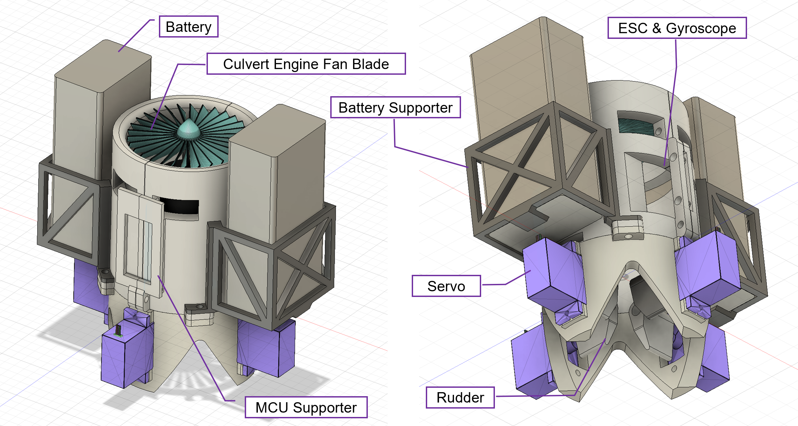
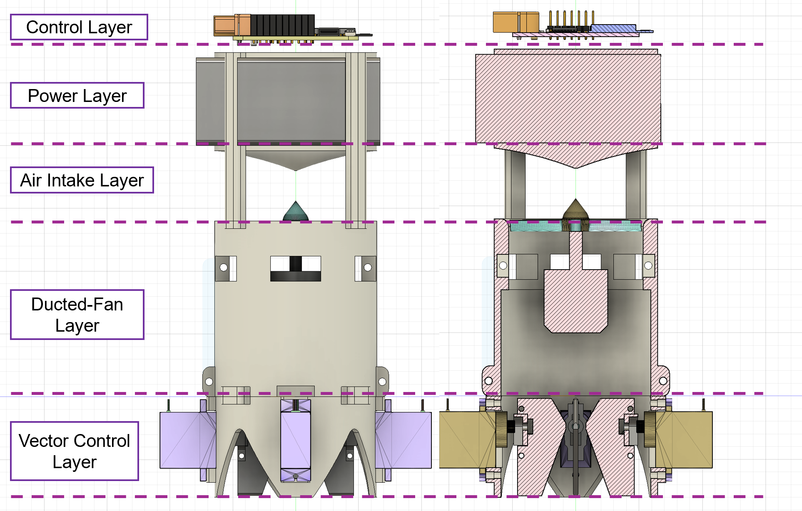
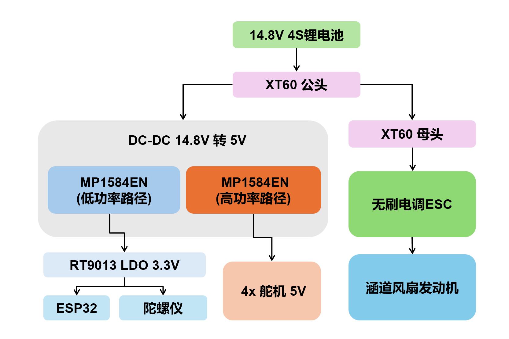
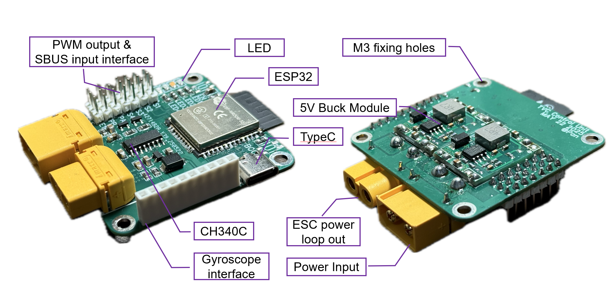
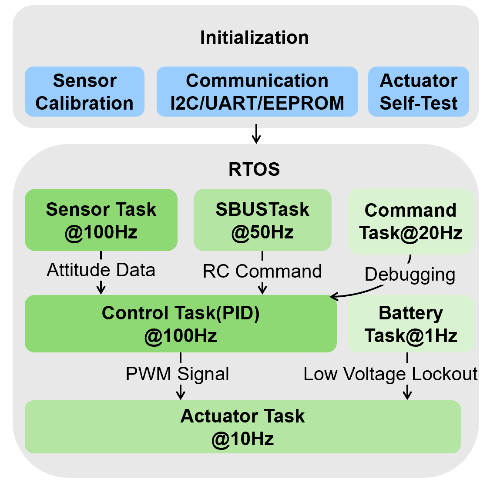
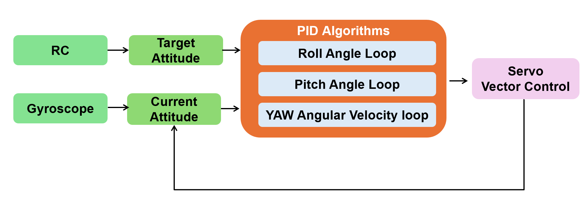
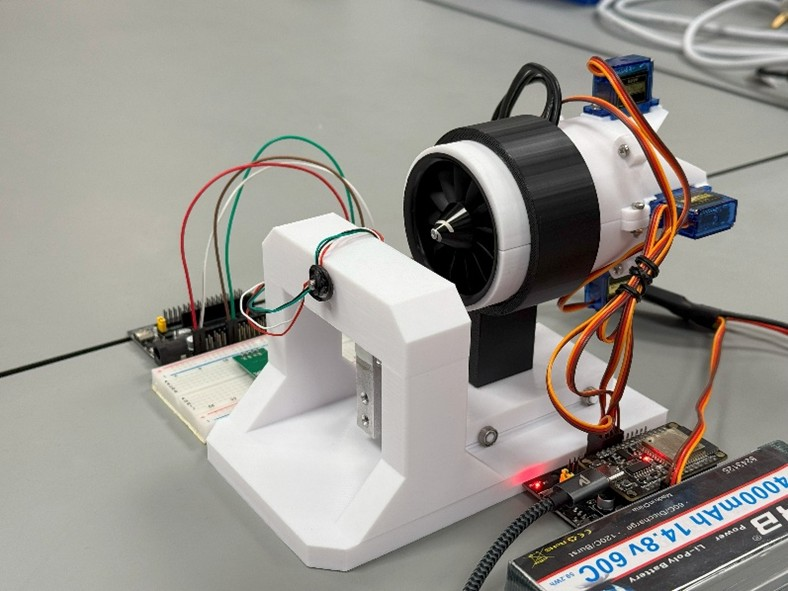
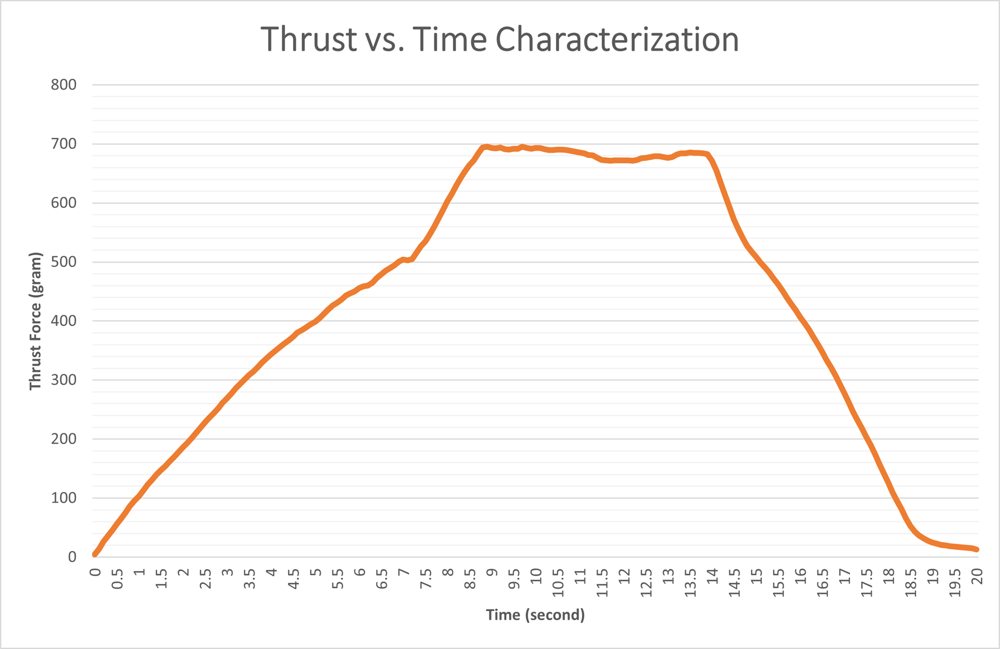
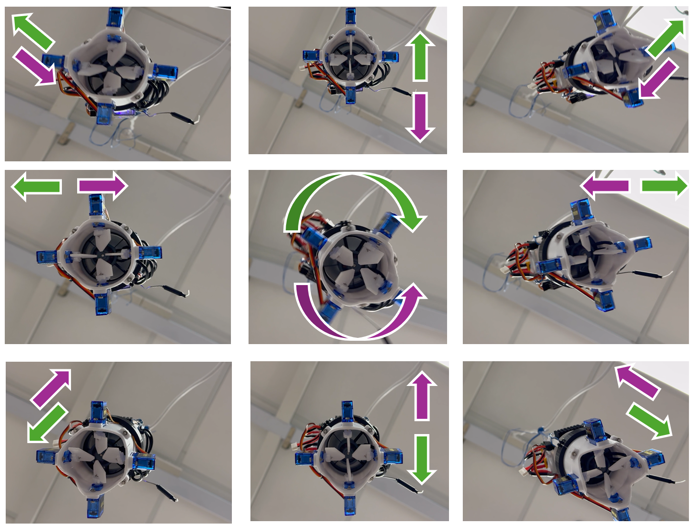

# 单函道风扇无人机的推力矢量控制(TVC)


这是一个关于使用陀螺仪传感器反馈，为单函道风扇无人机（UAV）实现推力矢量控制（Thrust Vector Control, TVC）的项目。

---

## 🚀 项目简介

### 什么是推力矢量控制 (TVC)？

让我们先来玩一个小游戏，想象一下，你想要用手掌托住一瓶倒立的矿泉水，并让它保持垂直不倒。

  当水瓶开始向左倾斜时，你的手会下意识地向左移动，产生一个反作用力，将水瓶推回中心。当它向右倾斜时，你的手又会向右移动来纠正它。从而实现平衡。

 本项目无人机的**推力矢量控制**原理与此非常相似。它底部的四个舵面就像你的手，机身就像那瓶水。当无人机的陀螺仪传感器（相当于咱们的眼睛和平衡感）检测到机身发生倾斜时，控制器会立刻命令相应的舵面偏转，改变高速气流的方向。这样，气流就会产生一个反作用力，将机身“推”回平衡状态。

通过对这个反作用力进行精准、快速的控制，无人机就能在没有多个螺旋桨的情况下，实现悬停、滚转、俯仰和偏航等全姿态的稳定飞行。

### 项目意义

与依赖电机转速差进行姿态控制的传统多旋翼无人机相比，单函道风扇 TVC 无人机具有以下显著优势：

* **增强的机动性:** 通过舵面偏转产生额外的控制力矩，显著增强了悬停和低速飞行时的姿态调整能力。
* **解耦控制:** 避免了传统多旋翼“倾斜机身以实现偏航”的耦合问题，可以实现更精准的平移和转向操控。
* **更高的安全性与效率:** 函道设计包裹了高速旋转的桨叶，提升了安全性，同时优化了气动效率。
* **结构简化:** 仅需1个函道风扇+4个舵机即可实现全姿态控制，大幅简化了机械结构和电子驱动部分，减轻了重量和体积。

---
### 项目难点

* **高频姿态解算与实时闭环控制** 
* **TVC控制抵消单发动机的自旋扭矩** 
* **推力矢量舵机控制与气动响应非线性** 
* **硬件轻量化设计 | 高低功率电源隔离 | FreeRTOS 多任务并行** 

---
## 🛠️ 硬件设计

硬件系统是实现稳定飞行的基础。本项目经历了从分布式模块到高度集成化设计的多次迭代，最终实现了结构紧凑、高可靠性的硬件平台。

### 1. 机械结构

机械结构经过了三个主要版本的迭代，全部采用 PLA 材料进行 3D 打印，兼顾了轻量化与结构刚性。

* **V1: 初版验证**
 
    * 采用分体式结构，主要用于验证各部件的装配尺寸和干涉问题。
    * **问题:** 封闭的底部结构阻挡了对角线方向的气流，导致矢量控制失效。


* **V2: 气流优化与双电池方案**
  
    * 底部对角区域进行大面积开孔，解决了气流遮挡问题，并增大了舵机行程。
    * 采用双电池对称布局以平衡重心，并设计了电调散热通道。
    * **问题:** 双电池方案导致总重量过大，接近推力极限，续航能力差。


* **V3: 最终版 - 垂直堆叠集成化设计**

    * 采用五层垂直堆叠结构，将重心集中于中轴线，减小了滚转/俯仰转动惯量。
    * 改用单电池方案，显著减轻了整机重量。
    * **优势:** 高度集成化，简化了布线，减少了电磁干扰，提升了控制响应速度。


### 2. 电子系统

电子系统的核心是定制化的 PCB，它集成了主控、电源管理、传感器接口和驱动等于一体。

* **核心控制器:** ESP32-WROOM-32 模块，其双核处理器和 FreeRTOS 支持为实时多任务处理提供了强大的算力保障。
* **传感器:** ICM-20948 九轴陀螺仪，通过其内置的数字运动处理器（DMP）直接输出四元数姿态数据，大大减轻了主控的计算负担。
* **硬件系统架构:** 遵循“感知→决策→执行”的闭环逻辑。



* **电源架构:** 采用单电池供电，通过两个独立的 DC-DC 模块实现高/低压分离供电。一路经 LDO 为 ESP32 和陀螺仪提供纯净的 3.3V 电源；另一路直接为4个舵机提供 5V 电源，满足其瞬时大电流需求。


* **定制四层 PCB:**

    * 顶层与底层：放置主要元器件和完整的接地层。
    * 内部信号层：走关键信号线，如 I2C 和 PWM，以减少干扰。
    * 大面积铺铜与过孔设计，以支持大电流传输。
    * 功率地和信号地采用0欧姆电阻连接。
    * 集成了自动下载电路、电源反接保护和状态指示灯等辅助功能。



---

## 💻 软件与算法

软件系统基于 FreeRTOS 实时操作系统构建，通过多任务并行处理，确保了控制系统的实时性和可靠性。


### 1. 软件架构

系统分为多个具有不同优先级和运行频率的任务：
* **高优先级任务:**
    * `SensorTask` (100Hz): 读取 IMU 数据并解算为欧拉角。
    * `ControlTask` (100Hz): 执行 PID 运算，生成舵机控制信号。
* **中优先级任务:**
    * `SBUSTask` (50Hz): 解析遥控器 SBUS 信号，映射为目标姿态。
* **低优先级任务:**
    * `BatteryTask` (1Hz): 监控电池电压，实现低压保护。
    * `ActuatorTask` (10Hz): 将控制信号输出至舵机。

### 2. PID 闭环控制

控制核心是 PID 算法，它根据当前姿态与目标姿态的误差来动态调整舵机角度。
* **滚转/俯仰:** 采用角度环控制，直接追踪遥控器设定的目标角度。
* **偏航:** 采用角速率环控制，追踪目标角速度，响应更平滑。



### 3. 推力矢量映射

PID 的输出值通过以下伪代码逻辑映射到四个舵机的具体偏转角度，从而实现对推力的矢量控制。

```cpp
// 矢量控制伪代码
if (!isArmed || lowVoltage) {
    set all servos to 90°; // 安全模式下舵机回中
} else {
    // 根据PID输出值和偏置，计算每个舵机的目标角度
    frontServo = 90 + pitchOut + frontBias + yawOut;
    backServo  = 90 - pitchOut + backBias - yawOut;
    leftServo  = 90 + rollOut  + leftBias  + yawOut;
    rightServo = 90 - rollOut  + rightBias - yawOut;
    
    send PWM to servos; // 发送PWM信号驱动舵机
}
```

---

## 🔬 测试与验证

为验证设计的有效性，我们进行了一系列地面和系留飞行测试。

### 1. 地面推力测试

我们搭建了专用的推力测试平台，以表征函道风扇的性能。
* **结果:** 测得最大推力约为 **700克**，且推力与油门近似呈线性关系。




### 2. 系留飞行测试

通过四根柔性绳索将无人机悬挂，在限制位移的同时，验证矢量控制系统的姿态调节能力。
* **结果:** 无人机能够稳定地响应遥控指令，在多个方向上实现姿态控制，并具备一定的抗干扰能力。测试验证了矢量控制逻辑的可行性。



---

## 存在的问题与未来工作

* **当前问题:** 在高油门（>70%）时，机身会出现低频抖动。这可能是由于单环 PID 易激发结构共振，以及舵机响应的相位滞后导致了过度补偿。
* **未来解决方案:**
    * **算法改进:** 采用**串级 PID**（外环姿态，内环角速率），并增加陷波滤波器和基于油门的增益调度。
    * **硬件改进:** 尝试使用**共轴反桨**函道风扇，从物理上抵消自旋力矩，从而简化控制回路，降低谐振风险。

---

## 💡 总结与创新

本项目成功开发并验证了一套紧凑的单函道风扇 TVC 无人机系统，其主要创新点包括：

1.  **机械创新:** 采用**垂直堆叠**的集成化设计，集中了重心，降低了转动惯量，同时实现了轻量化。
2.  **电气创新:** 创新的**单电池高低压分离供电方案**和高度集成的**四层 PCB**，显著减重并提升了系统可靠性。
3.  **算法创新:** 在 FreeRTOS 上整合了 IMU-DMP、PID 和 SBUS 解码，实现了**高频率、低延迟**的闭环控制，仅用四个小舵面就完成了传统多旋翼的复杂姿态控制。

该研究证实了 TVC 技术在单函道无人机姿态调节中的可行性，为未来在复杂环境中应用的高机动性、高安全性无人机技术奠定了实践基础。
